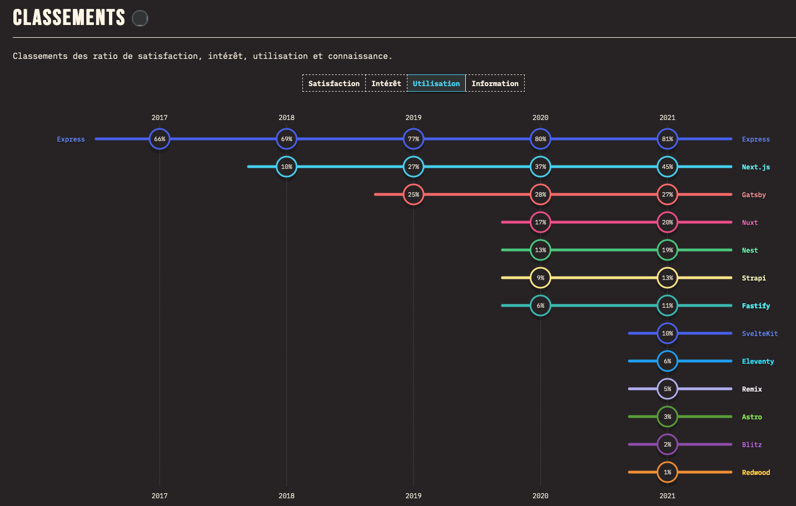

# Choix du framework nestJS

Date : 30/11/2022

## Statut

**Accepté**

## Contexte

Le traitement Judilibre dispose d'applications backend développées avec le framework [ExpressJS](https://expressjs.com/fr/), qui est le [framework NodeJS le plus commun](https://2021.stateofjs.com/fr-FR/libraries/back-end-frameworks/).

Pour les traitements JuriTJ, nous souhaitions comparer [NestJS](https://nestjs.com/) à [ExpressJS](https://expressjs.com/fr/), de manière à disposer d'un outil adapté à notre besoin. 

#### Popularité 

ExpressJS est le framework le plus utilisé de l'éco-système NodeJS. 
Illustration via les [npm trends](https://npmtrends.com/@nestjs/core-vs-express) : 

Illustration via l'enquête [StateOfJS](https://2021.stateofjs.com/fr-FR/libraries/back-end-frameworks/) : 

#### Forces / Faiblesses en synthèse

| Framework  | Forces | Faiblesses |
|------------|--------|------------|
| ExpressJS  | Léger, flexible, scalable  | Nécessite beaucoup de structuration, language non typé, éco-système assez pauvre qui nécessite parfois de recréer des outils basiques |
| NestJS     | Ecosystème riche et prêt à l'emploi, conventions fortes, Typescript, framework de test intégré, modulaire, scalable | Prévoir une montée en compétences, framework moins populaire, quid du maintien de la solution dans le temps ? |

## Décision

Nous avons finalement opté pour le framework NestJS. Ce qui nous a convaincu : 
- la richesse de son écosystème 
- sa structure et ses conventions qui guident les développeurs
- la richesse de sa documentation
- la possibilité de malgré tout s'appuyer sur Express et ses fonctionnalités